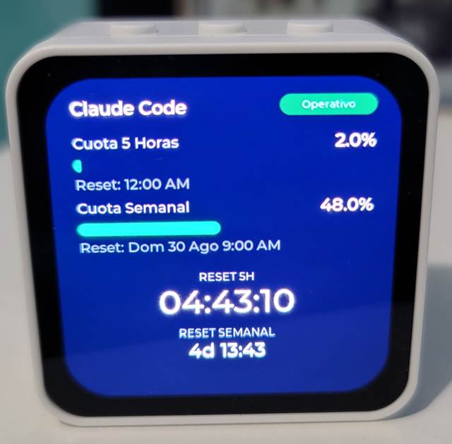

# esp32-ai-monitor

Ambient AI provider quota/health monitor: a Go backend polls Claude Code credentials and its upstream status feed, and an ESP32-S3 AMOLED display (`firmware/`) shows the result.



## Hardware

This project targets exactly one board: the **Waveshare ESP32-S3-Touch-AMOLED-2.16**, bought from <https://es.aliexpress.com/item/1005011930415731.html>.

- **MCU**: ESP32-S3R8, dual-core Xtensa LX7 @ 240 MHz, 16 MB flash, 8 MB PSRAM (OPI)
- **Display**: 2.16" 480×480 CO5300 QSPI AMOLED, 16.7M colours
- **Input**: CST9220 capacitive touch, QMI8658 6-axis IMU
- **Audio**: ES8311 codec with onboard amplifier, dual microphones
- **Power**: AXP2101 PMIC (battery charging, brightness, suspend)
- **Radio**: Wi-Fi 2.4 GHz, BLE 5

The pinout, driver framing and bring-up quirks are specific to this board and are documented in [`firmware/README.md`](firmware/README.md). Sibling boards in the AMOLED family use different GPIOs, so none of it transfers unverified.

The backend itself is hardware-agnostic: it is a plain HTTP service and runs on Windows or Linux, natively or in Docker. Inside a container it is always Linux, so credential paths there are fixed; on the host it resolves them portably via `os.UserHomeDir()`.

## What the device does

The firmware polls `GET /api/dashboard` every few seconds and renders a single Claude card:

- **Quota at a glance** — 5-hour and weekly usage bars with their percentage, plus a live countdown to each reset, ticked on-device at 1 Hz (`HH:MM:SS`, or `Nd HH:MM` when the reset is days out). The backend seeds that countdown in seconds, so the board never needs a real clock.
- **Provider health** — the current Claude service status from the upstream status feed, shown as a pill on the card.
- **Audio alerts** — the ES8311 codec plays a notification sound twice (PCM embedded in flash, no on-device decoding) when the provider degrades and a chime when it recovers, so a status change is noticeable without looking at the screen.
- **Honest empty states** — a `SIN CONEXION` badge when data is stale (either the backend says so, or no poll has succeeded in `STALE_AFTER_MS`), `Sin datos` when a quota window has no real reading, and a full-screen overlay only when Claude genuinely needs a re-login — never on a transient probe failure.
- **Accelerometer rotation** — the QMI8658 IMU detects the board's orientation and rotates the panel in hardware via MADCTL, so there is no per-frame CPU cost. A confirmed turn also wakes the screen.
- **Auto-dim and suspend** — the AXP2101 dims the panel after `AUTO_DIM_MS` of inactivity and can sleep it after `AUTO_SLEEP_MS`. The KEY button (`GPIO18`) suspends and wakes it on demand, and a touch, a button press or a rotation all count as activity and restore full brightness.

Timing knobs (poll interval, dim and sleep delays, staleness threshold) live in `firmware/include/config.h`.

## Running the backend natively

```bash
cd backend
go run ./cmd/server
```

It serves `GET /api/dashboard` (the payload the firmware polls) and `GET /healthz` on port 8080.

Credentials are discovered relative to the user's home directory on whichever OS runs the binary:

- Claude Code: `~/.claude/.credentials.json` and `~/.claude.json` (`%USERPROFILE%\.claude\.credentials.json` / `%USERPROFILE%\.claude.json` on Windows)

Override with `CLAUDE_CONFIG_DIR` if your CLI installs elsewhere.

## Running the backend with Docker

The container is always Linux and runs as the non-root `appuser`, so `CLAUDE_CONFIG_DIR` inside `docker-compose.yml` stays fixed at `/home/appuser/.claude`. `/root` is mode 0700 and unreadable to that user, so the mount must not go there.

The host-side mount source varies by OS, so it is supplied via the `HOST_HOME` environment variable instead of `$HOME` (which does not exist on native Windows shells):

1. Copy `.env.example` to `.env`.
2. Set `HOST_HOME` to your home directory:
   - **Windows (PowerShell)**: `HOST_HOME=C:/Users/<you>` — use forward slashes; Compose splits volume specs on `:` and backslash paths are easier to get wrong.
   - **Linux / macOS**: `HOST_HOME=/home/<you>` (or `$HOME`)
3. Set `TZ` to your IANA timezone (e.g. `America/Guatemala`). It formats `reset_time`; leaving it unset means UTC and every clock the firmware shows is offset.
4. Run:
   ```bash
   docker compose up --build
   ```

After editing Go code, re-run with `--build`. Without it Compose reuses the existing image and the device keeps polling the old backend while everything looks fine locally.

## Flashing the firmware

See [`firmware/README.md`](firmware/README.md) for PlatformIO setup, the Wi-Fi/backend URL secrets file, and the flash command. Short version:

```bash
cd firmware
pio run -e esp32-s3-touch-amoled-216 -t upload -t monitor --upload-port COM7
```

`DASHBOARD_URL` must point at the machine running the backend and be reachable from the device's network — not `localhost`.

## Repository layout

- `backend/` — Go HTTP service polling provider metrics and status.
- `firmware/` — PlatformIO/Arduino firmware for the ESP32-S3-Touch-AMOLED-2.16.
