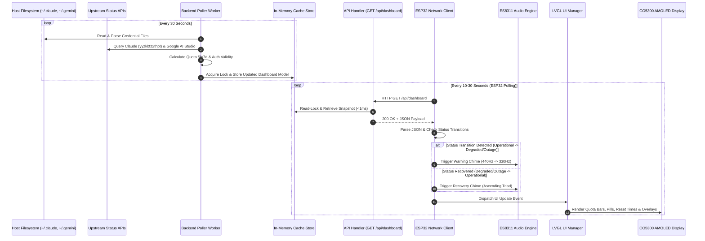
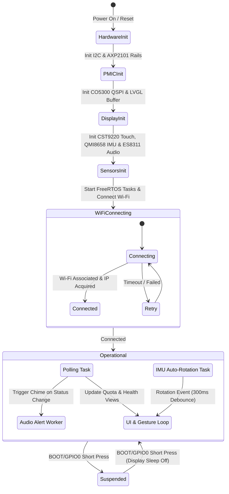

# Technical Design: init-ai-monitor

## 1. Technical Approach

The `init-ai-monitor` system is a distributed, low-footprint hardware and software solution designed to provide real-time, ambient visibility into AI quota consumption (Claude Code and Google Antigravity), credential health, and upstream service availability.

The architecture comprises two decoupled components communicating over local Wi-Fi:
1. **Backend Service (Go)**: A minimalist HTTP daemon (<10MB RAM) packaged in Docker. It periodically discovers and evaluates local CLI credentials (`~/.claude` and `~/.gemini`), queries provider upstream health APIs, computes 5-hour rolling and 7-day weekly quota utilization, and serves cached JSON payloads via `GET /api/dashboard` and `GET /healthz`.
2. **Embedded Firmware (ESP32-S3 / C++ PlatformIO)**: A high-performance firmware running on the Waveshare ESP32-S3-Touch-AMOLED-2.16 development board. It powers a 2.16" 480x480 AMOLED display via LVGL, supports horizontal swipe gesture navigation, monitors physical device orientation via 6-axis IMU (300ms debounce), provides audio chimes via ES8311 I2S codec on status transitions, and manages AMOLED screen suspend/wake via PMIC AXP2101 and BOOT/GPIO0 without disrupting background Wi-Fi polling.

```mermaid
flowchart TB
    subgraph Host["Host Machine / Docker"]
        CredClaude["~/.claude (Session / Token)"]
        CredGemini["~/.gemini (Credentials / Token)"]
        StatusClaude["status.claude.com API (ID: yyzkbfz2thpt)"]
        StatusGoogle["Google AI Studio Health"]
        
        subgraph Backend["Go Backend Daemon (<10MB RSS)"]
            Worker["Background Poller (30s Ticker)"]
            Watcher["Credential & Status Watcher"]
            Cache["Thread-Safe In-Memory Cache (sync.RWMutex)"]
            Server["HTTP Server (:8080 stdlib net/http)"]
            
            Watcher -->|Parse & Validate| CredClaude
            Watcher -->|Parse & Validate| CredGemini
            Watcher -->|Scrape Status| StatusClaude
            Watcher -->|Scrape Status| StatusGoogle
            Worker --> Watcher
            Watcher -->|Write Update| Cache
            Cache -->|Read Lock <1ms| Server
        end
    end

    subgraph ESP32["ESP32-S3 AMOLED Monitor (2.16\" 480x480)"]
        WiFiTask["Network Client (HTTP Polling Loop)"]
        UIEngine["LVGL Dual-View Engine"]
        Display["CO5300 AMOLED (QSPI 480x480)"]
        Touch["CST9220 Touch (I2C)"]
        IMU["QMI8658 6-Axis IMU (Debounced Auto-Rotation)"]
        Audio["ES8311 I2S Codec (Chimes & Alerts)"]
        PMIC["AXP2101 PMIC & BOOT Button (Screen Sleep/Wake)"]
        
        Server -->|GET /api/dashboard| WiFiTask
        WiFiTask -->|Update State| UIEngine
        WiFiTask -->|Status Transition Event| Audio
        IMU -->|Rotation 0/90/180/270| UIEngine
        Touch -->|Swipe Gestures| UIEngine
        PMIC -->|Display Power Toggle| Display
        UIEngine -->|Draw Buffers| Display
    end
```

---

## 2. Architecture Decisions

### ADR-01: Go Standard Library over Web Frameworks for Backend
- **Context**: The backend service runs continuously in background or Docker alongside developer tools, requiring strict memory efficiency (<10MB RSS).
- **Choice**: Use Go standard library `net/http` and `http.ServeMux` with zero third-party web framework dependencies.
- **Alternatives**: Gin, Fiber, Echo.
- **Rationale**: Third-party frameworks introduce extra memory footprint, reflection allocations, and dependency surface. The standard library easily satisfies all routing requirements (`/api/dashboard`, `/healthz`) with sub-millisecond latencies and under 5MB baseline RSS.

### ADR-02: Decoupled Background Polling & In-Memory Read Cache
- **Context**: Embedded clients poll the backend every 10–30 seconds. Upstream status checks and filesystem reads must not block HTTP request handling.
- **Choice**: Dedicated background worker goroutine with `time.Ticker` updates a cached `model.DashboardResponse` protected by `sync.RWMutex`. HTTP handlers read directly from memory.
- **Alternatives**: On-demand fetching per HTTP request, atomic pointer swap.
- **Rationale**: Eliminates upstream rate limits, shields the HTTP layer from upstream latency spikes, and ensures incoming client requests return in <1ms without disk or network I/O.

### ADR-03: Multi-Stage Docker Container with Scratch / Minimal Alpine Runner
- **Context**: Container image must be lightweight (<20MB) and secure while allowing read-only mounts to host configuration directories.
- **Choice**: Multi-stage `golang:1.26-alpine` builder producing a statically linked binary executed by a non-root user in minimal `alpine:3.20` (or `scratch` with ca-certificates).
- **Alternatives**: Heavy Debian/Ubuntu base images, running directly as host process.
- **Rationale**: Minimal attack surface, container isolation, and negligible memory overhead conforming to the <10MB RAM ceiling.

### ADR-04: LVGL Dual-View UI with Horizontal Swipe Gestures
- **Context**: The 2.16" 480x480 circular/square AMOLED screen requires clear, glanceable layout for two providers without cluttered on-screen buttons.
- **Choice**: LVGL tileview/screen container with swipe gesture detection, visual status pills, custom horizontal progress bars, and bottom page indicator dots (`● ○` / `○ ●`).
- **Alternatives**: Tabview with tabs, automatic timed carousel, physical button view toggle.
- **Rationale**: Natural touch navigation, maximizing visual area for quota numbers, reset countdowns, and warning overlay cards.

### ADR-05: Non-Destructive Screen Suspend via AXP2101 PMIC & Display Sleep
- **Context**: Users need to turn off the AMOLED display at night or when away without tearing down the Wi-Fi connection or losing state.
- **Choice**: Intercept BOOT/GPIO0 button presses to command CO5300 sleep mode (`0x10 Sleep In` / `0x11 Sleep Out`) and toggle the AMOLED BLDO power rail via AXP2101, keeping ESP32-S3 CPU, Wi-Fi, and background polling active.
- **Alternatives**: Deep sleep / Light sleep of ESP32 MCU.
- **Rationale**: ESP32 deep sleep requires Wi-Fi re-association (2–5 seconds) and cold boot reload upon wake. Retaining active network polling ensures instantaneous wake (<50ms) with pre-cached metrics.

### ADR-06: IMU-Driven 4-Way Auto-Rotation with 300ms Debounce
- **Context**: Physical orientation changes must dynamically rotate the display (0°, 90°, 180°, 270°) and touch coordinates while ignoring transient desk shakes.
- **Choice**: Background FreeRTOS task reads QMI8658 accelerometer gravity vectors, computes orientation quadrant, and requires 300ms stability before applying `lv_disp_set_rotation`.
- **Alternatives**: Continuous raw angle transform, manual rotation toggle.
- **Rationale**: Provides smooth 4-orientation desktop placement versatility without UI flickering or accidental triggers during handling.

---

## 3. Data Flow



---

## 4. File Changes & Directory Structure

```
esp32-ai-monitor/
├── backend/
│   ├── cmd/
│   │   └── server/
│   │       └── main.go                  # Application entrypoint & signal handling
│   ├── internal/
│   │   ├── api/
│   │   │   ├── router.go                # HTTP router and route registration
│   │   │   ├── handler.go               # Dashboard and health HTTP handlers
│   │   │   ├── handler_test.go          # Unit tests for HTTP handlers
│   │   │   └── middleware.go            # Logging, CORS, and panic recovery
│   │   ├── config/
│   │   │   ├── config.go                # Environment variable & path configuration
│   │   │   └── config_test.go           # Unit tests for config loading
│   │   ├── model/
│   │   │   └── dashboard.go             # Data structs (DashboardResponse, Provider, Metrics)
│   │   └── provider/
│   │       ├── provider.go              # Provider interface & manager orchestration
│   │       ├── claude.go                # Claude credentials parser & quota engine
│   │       ├── claude_test.go           # Unit tests for Claude provider
│   │       ├── antigravity.go           # Antigravity credentials parser & quota engine
│   │       ├── antigravity_test.go      # Unit tests for Antigravity provider
│   │       ├── status_scraper.go        # Upstream status API client & component filtering
│   │       ├── status_scraper_test.go   # Unit tests for status scrapers
│   │       ├── token_watcher.go         # File watcher / periodic scanner for recovery
│   │       └── token_watcher_test.go    # Unit tests for token watcher
│   ├── Dockerfile                       # Multi-stage Go build (<15MB image)
│   ├── docker-compose.yml               # Container orchestration with volume mounts
│   ├── go.mod                           # Go module definition (Go 1.26+)
│   └── go.sum
├── firmware/
│   ├── include/
│   │   ├── config.h                     # Hardware pinout definitions & Wi-Fi settings
│   │   ├── display_co5300.h             # CO5300 QSPI AMOLED display driver header
│   │   ├── touch_cst9220.h              # CST9220 I2C capacitive touch driver header
│   │   ├── imu_qmi8658.h                # QMI8658 6-axis IMU auto-rotation header
│   │   ├── audio_es8311.h               # ES8311 I2S audio codec & synthesizer header
│   │   ├── pmic_axp2101.h               # AXP2101 PMIC & power button header
│   │   ├── ui_manager.h                 # LVGL dual-screen UI manager header
│   │   └── network_client.h             # Wi-Fi & HTTP dashboard polling client header
│   ├── src/
│   │   ├── main.cpp                     # Firmware setup, FreeRTOS tasks, main loop
│   │   ├── display_co5300.cpp           # CO5300 init sequence & LVGL flush callback
│   │   ├── touch_cst9220.cpp            # CST9220 I2C touch reading & LVGL indev driver
│   │   ├── imu_qmi8658.cpp              # QMI8658 polling & 300ms debounced rotation task
│   │   ├── audio_es8311.cpp             # ES8311 I2S init, tone generator & chime player
│   │   ├── pmic_axp2101.cpp             # AXP2101 power rail setup & suspend/wake handler
│   │   ├── ui_manager.cpp               # LVGL screens, swipe handling, pills & quota bars
│   │   └── network_client.cpp           # FreeRTOS HTTP polling task & JSON parser
│   └── platformio.ini                   # PlatformIO build configuration for ESP32-S3
└── openspec/
    ├── config.yaml
    └── changes/
        └── init-ai-monitor/
            ├── proposal.md
            ├── design.md                # (This Document)
            └── specs/
                ├── dashboard-api/spec.md
                ├── provider-metrics/spec.md
                ├── firmware-ui/spec.md
                └── firmware-hardware/spec.md
```

---

## 5. Interfaces & Contracts

### 5.1 Dashboard API Response Contract (`GET /api/dashboard`)

```json
{
  "timestamp": 1756083867,
  "providers": [
    {
      "id": "claude",
      "name": "Claude Code",
      "status": "operational",
      "auth_valid": true,
      "re_login_required": false,
      "metrics": {
        "quota_5h": {
          "used": 42.5,
          "limit": 100.0,
          "percentage": 42.5,
          "reset_time": "15:30",
          "reset_timestamp": 1756090200
        },
        "quota_weekly": {
          "used": 150.0,
          "limit": 500.0,
          "percentage": 30.0,
          "reset_time": "Dom 00:00",
          "reset_timestamp": 1756684800
        }
      }
    },
    {
      "id": "antigravity",
      "name": "Google Antigravity",
      "status": "operational",
      "auth_valid": true,
      "re_login_required": false,
      "metrics": {
        "quota_5h": {
          "used": 12.0,
          "limit": 100.0,
          "percentage": 12.0,
          "reset_time": "18:00",
          "reset_timestamp": 1756099200
        },
        "quota_weekly": {
          "used": 80.0,
          "limit": 1000.0,
          "percentage": 8.0,
          "reset_time": "Lun 00:00",
          "reset_timestamp": 1756771200
        }
      }
    }
  ],
  "system": {
    "uptime_seconds": 3600,
    "memory_mb": 4.8
  }
}
```

### 5.2 Go Data Models (`internal/model/dashboard.go`)

```go
package model

type ProviderStatus string

const (
    StatusOperational ProviderStatus = "operational"
    StatusDegraded    ProviderStatus = "degraded"
    StatusOutage      ProviderStatus = "outage"
)

type QuotaWindow struct {
    Used           float64 `json:"used"`
    Limit          float64 `json:"limit"`
    Percentage     float64 `json:"percentage"`
    ResetTime      string  `json:"reset_time"`
    ResetTimestamp int64   `json:"reset_timestamp"`
}

type ProviderMetrics struct {
    Quota5h     QuotaWindow `json:"quota_5h"`
    QuotaWeekly QuotaWindow `json:"quota_weekly"`
}

type Provider struct {
    ID              string          `json:"id"`
    Name            string          `json:"name"`
    Status          ProviderStatus  `json:"status"`
    AuthValid       bool            `json:"auth_valid"`
    ReLoginRequired bool            `json:"re_login_required"`
    Metrics         ProviderMetrics `json:"metrics"`
}

type SystemMetrics struct {
    UptimeSeconds int64   `json:"uptime_seconds"`
    MemoryMB      float64 `json:"memory_mb"`
}

type DashboardResponse struct {
    Timestamp int64         `json:"timestamp"`
    Providers []Provider    `json:"providers"`
    System    SystemMetrics `json:"system"`
}
```

### 5.3 Backend Configuration Contract (`internal/config/config.go`)

```go
package config

import (
    "os"
    "path/filepath"
    "time"
)

type Config struct {
    Port            string
    PollInterval    time.Duration
    ClaudeConfigDir string
    GeminiConfigDir string
}

func LoadConfig() *Config {
    homeDir, _ := os.UserHomeDir()
    
    port := os.Getenv("PORT")
    if port == "" {
        port = "8080"
    }
    
    claudeDir := os.Getenv("CLAUDE_CONFIG_DIR")
    if claudeDir == "" {
        claudeDir = filepath.Join(homeDir, ".claude")
    }
    
    geminiDir := os.Getenv("GEMINI_CONFIG_DIR")
    if geminiDir == "" {
        geminiDir = filepath.Join(homeDir, ".gemini")
    }
    
    return &Config{
        Port:            port,
        PollInterval:    30 * time.Second,
        ClaudeConfigDir: claudeDir,
        GeminiConfigDir: geminiDir,
    }
}
```

### 5.4 Docker Deployment Configuration

#### `backend/Dockerfile`
```dockerfile
# Stage 1: Build static binary
FROM golang:1.26-alpine AS builder
WORKDIR /app
COPY go.mod go.sum ./
RUN go mod download
COPY . .
RUN CGO_ENABLED=0 GOOS=linux go build -ldflags="-s -w" -o server ./cmd/server

# Stage 2: Minimal runtime image (<15MB)
FROM alpine:3.20
RUN apk --no-cache add ca-certificates tzdata
RUN adduser -D -u 1000 appuser
WORKDIR /app
COPY --from=builder /app/server /app/server
USER appuser
EXPOSE 8080
ENV GOMEMLIMIT=8MiB
ENTRYPOINT ["/app/server"]
```

#### `backend/docker-compose.yml`
```yaml
version: '3.8'

services:
  ai-monitor-backend:
    build:
      context: .
      dockerfile: Dockerfile
    container_name: ai-monitor-backend
    restart: unless-stopped
    ports:
      - "8080:8080"
    environment:
      - PORT=8080
      - CLAUDE_CONFIG_DIR=/root/.claude
      - GEMINI_CONFIG_DIR=/root/.gemini
      - GOMEMLIMIT=8MiB
    volumes:
      - ${HOME}/.claude:/root/.claude:ro
      - ${HOME}/.gemini:/root/.gemini:ro
    healthcheck:
      test: ["CMD", "wget", "-qO-", "http://localhost:8080/healthz"]
      interval: 30s
      timeout: 3s
      retries: 3
```

### 5.5 Hardware Pin Definitions (`firmware/include/config.h`)

```cpp
#pragma once

// ==========================================
// Waveshare ESP32-S3-Touch-AMOLED-2.16 Pinout
// ==========================================

// Display (CO5300 QSPI 480x480)
#define LCD_QSPI_CS       9
#define LCD_QSPI_SCK      10
#define LCD_QSPI_D0       11
#define LCD_QSPI_D1       12
#define LCD_QSPI_D2       13
#define LCD_QSPI_D3       14
#define LCD_RST_PIN       8
#define LCD_TE_PIN        18
#define LCD_WIDTH         480
#define LCD_HEIGHT        480

// Touch (CST9220 I2C) & Shared I2C Bus
#define I2C_SDA_PIN       15
#define I2C_SCL_PIN       16
#define TOUCH_INT_PIN     21
#define TOUCH_RST_PIN     -1

// IMU (QMI8658 6-Axis Accelerometer/Gyroscope)
#define IMU_I2C_ADDR      0x6B
#define IMU_INT1_PIN      4

// Audio Codec (ES8311 I2S & I2C Control)
#define ES8311_I2C_ADDR   0x18
#define I2S_BCLK_PIN      40
#define I2S_WS_PIN        41
#define I2S_DOUT_PIN      42
#define I2S_MCLK_PIN      39
#define PA_ENABLE_PIN     46

// PMIC (AXP2101) & Power Management
#define AXP2101_I2C_ADDR  0x34
#define PMIC_IRQ_PIN      3
#define BOOT_BUTTON_PIN   0

// Network & Dashboard API Defaults
#define DEFAULT_WIFI_SSID "YourWiFiSSID"
#define DEFAULT_WIFI_PASS "YourWiFiPassword"
#define DASHBOARD_API_URL "http://192.168.1.100:8080/api/dashboard"
#define POLL_INTERVAL_MS  30000
```

### 5.6 Firmware State Machine & Tasks



---

## 6. Testing Strategy

### 6.1 Backend Unit Testing (Go TDD >= 80% Coverage)

All backend modules will follow strict Test-Driven Development (TDD) using standard Go test tooling (`go test -v -race -cover ./...`):

1. **`internal/config/config_test.go`**:
   - Verify environment variable overrides (`PORT`, `CLAUDE_CONFIG_DIR`, `GEMINI_CONFIG_DIR`).
   - Validate fallback to `$HOME/.claude` and `$HOME/.gemini`.
2. **`internal/provider/claude_test.go` & `antigravity_test.go`**:
   - Mock filesystem directory reads with simulated valid, malformed, empty, and missing JSON session files.
   - Assert accurate setting of `auth_valid` and `re_login_required` flags.
   - Validate quota percentage calculations and reset timestamp formatters (`HH:MM` and `Dom 00:00`).
3. **`internal/provider/status_scraper_test.go`**:
   - Mock upstream HTTP server responses for `https://status.claude.com/api/v2/summary.json`.
   - Assert exact filtering of component `yyzkbfz2thpt` (Claude Code) across `operational`, `degraded_performance`, and `major_outage` states.
   - Assert retention of last valid status upon upstream network failure without panicking.
4. **`internal/api/handler_test.go`**:
   - Execute concurrent `GET /api/dashboard` requests with `httptest.NewRecorder` and `httptest.NewServer`.
   - Assert HTTP 200, valid `Content-Type: application/json`, and conformance to schema.
   - Validate `GET /healthz` returns `{"status":"ok"}`.
   - Assert response time under 10ms with concurrent read locks.

### 6.2 Firmware Hardware-in-the-Loop & Component Testing

1. **Display & Touch Verification**:
   - Screen test pattern rendering at native 480x480 RGB565.
   - Touch coordinate verification across 4 quadrants.
   - Horizontal swipe velocity and threshold validation (distance > 50px).
2. **IMU Auto-Rotation Debounce Test**:
   - Inject orientation changes; verify rotation triggers strictly after 300ms of stable readings.
   - Inject transient tilt noise (<200ms); verify rotation does NOT trigger.
3. **Audio Tone Generation Test**:
   - Verify I2S DMA buffer allocation and audible degradation warning tone and recovery chime without clipping or audio popping.
4. **PMIC Suspend/Wake Benchmark**:
   - Verify display sleep/wake sequence does not block Wi-Fi polling or drop TCP sockets.

---

## 7. Threat Matrix

| Threat ID | Threat Description | Severity | Impact | Mitigation Strategy |
| :--- | :--- | :--- | :--- | :--- |
| **TM-01** | Unauthorized local network access to token metadata | Medium | Exposure of quota percentage or account status | API endpoints expose only non-sensitive percentage metrics and reset times; access tokens and secrets are never returned in JSON payloads. Read-only filesystem mounts inside container. |
| **TM-02** | Credential file lock contention or file corruption | Low | Service crash or parse failure | Provider parser uses read-only file access (`os.Open`), reads into memory buffer, and gracefully handles partial/malformed JSON by setting `re_login_required: true` without panicking. |
| **TM-03** | Upstream status API DDoS / rate limiting | Medium | Backend worker rate limited or blocked | Background poller enforces fixed 30s interval with cached values; client requests never trigger synchronous upstream requests. |
| **TM-04** | Memory leak causing container OOM (>10MB RSS) | Medium | Backend container restart | Use zero-framework stdlib Go, avoid unbounded slice allocations, use streaming JSON encoders (`json.NewEncoder`), and configure `GOMEMLIMIT=8MiB`. |
| **TM-05** | Wi-Fi disconnect causing firmware hang | Low | Stalled UI or unresponsive display | Network client runs in an isolated FreeRTOS task with exponential reconnect backoff; UI rendering and touch handling continue uninterrupted using cached data. |

---

## 8. Migration & Rollout Plan

1. **Step 1 - Backend Scaffolding & TDD**:
   - Implement `internal/model` and `internal/config`.
   - Implement `internal/provider` parsers, token watchers, and status scrapers with unit tests.
   - Implement `internal/api` router, handlers, and middleware with unit tests.
   - Verify >= 80% test coverage and memory footprint < 10MB RSS.
2. **Step 2 - Containerization**:
   - Build multi-stage Docker image and verify runtime with `docker-compose up -d`.
   - Test read-only volume mounts with host credentials (`~/.claude`, `~/.gemini`).
3. **Step 3 - Embedded Firmware Drivers**:
   - Configure `platformio.ini` with ESP-IDF / Arduino framework and LVGL dependencies.
   - Implement hardware drivers: `display_co5300`, `touch_cst9220`, `imu_qmi8658`, `audio_es8311`, `pmic_axp2101`.
4. **Step 4 - UI & Network Integration**:
   - Implement `ui_manager` with LVGL dual views, swipe gestures, quota bars, and warning cards.
   - Implement `network_client` HTTP polling task and audio chime event triggers.
5. **Step 5 - Hardware Validation & Flashing**:
   - Flash firmware to ESP32-S3 over COM7.
   - Validate gesture transitions, IMU auto-rotation, audio alerts, and suspend/wake button toggle.

---

## 9. Open Questions & Future Enhancements

1. **Multi-Account Support**: Currently assumes a single active Claude and Antigravity profile on the host. Future revisions can support switching between multiple workspace profiles.
2. **Dynamic Wi-Fi Provisioning**: In the initial bootstrap, Wi-Fi credentials are set via `config.h` or build flags. A future enhancement can provide an onboard BLE / Captive Portal Wi-Fi manager.
